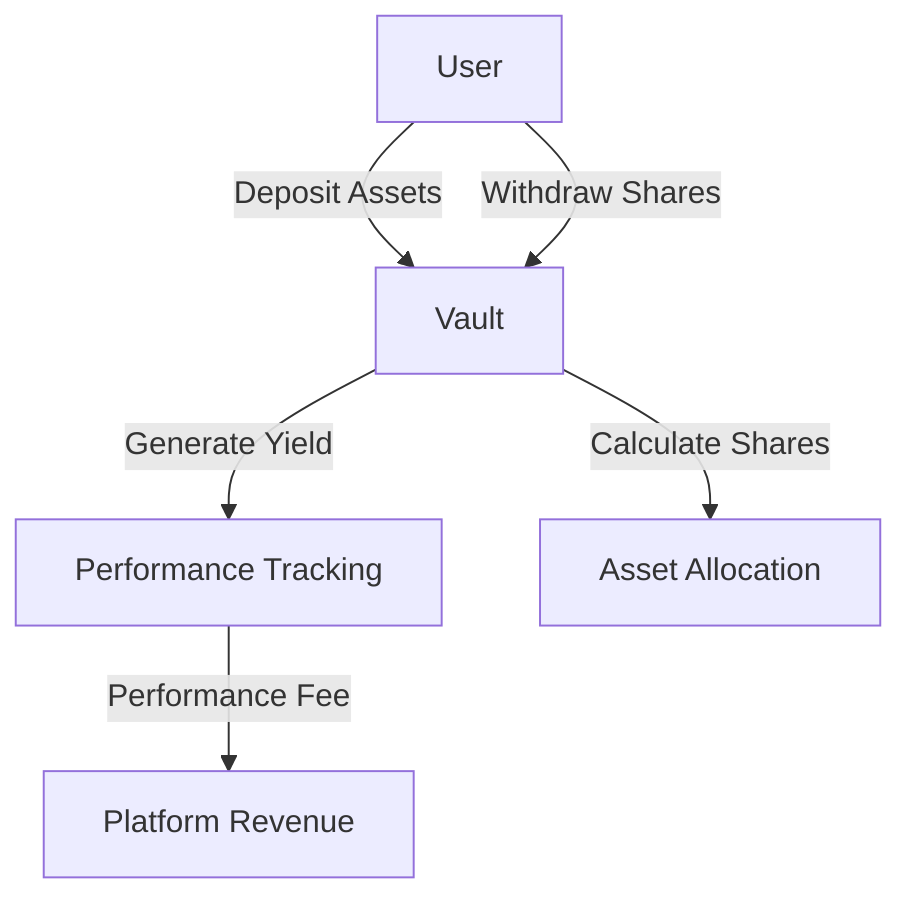

# Breakthrough ERC4626 Vault Analyzer

A cutting-edge Clarity smart contract for comprehensive analysis and management of ERC4626 yield-bearing vaults on the Stacks blockchain. This advanced contract provides deep insights into vault performance, implements robust security mechanisms, and offers flexible yield optimization strategies.

## Overview

Breakthrough ERC4626 Vault Analyzer enables:
- Comprehensive vault performance tracking
- Advanced yield generation and distribution
- Sophisticated deposit and withdrawal mechanisms
- Enhanced security with emergency pause functionality
- Performance fee optimization
- Real-time vault analytics

## Architecture



The system uses advanced data maps to track:
- Vault configurations and states
- User share balances
- Performance metrics
- Deposit and withdrawal limits
- Yield generation strategies

## Contract Documentation

### Main Contract: erc4626-vault-analyzer

Core functionalities:

1. **Vault Management**
   - Configure vault parameters
   - Set performance fees
   - Implement deposit and withdrawal limits
   - Emergency pause mechanism

2. **Asset Handling**
   - Dynamic share calculation
   - Performance-based fee extraction
   - Secure asset transfers
   - Limit enforcement

3. **Analytics and Tracking**
   - Total assets tracking
   - User share management
   - Yield generation monitoring

## Getting Started

### Prerequisites
- Clarinet installation
- Stacks wallet
- STX tokens for vault interactions

### Basic Usage

**1. Configuring a Vault**
```clarity
(contract-call? .erc4626-vault-analyzer configure-vault
    u1 ;; vault-id
    u10000 ;; total-assets
    u50 ;; performance-fee (5%)
    u5000 ;; deposit-limit
    u5000 ;; withdrawal-limit
)
```

**2. Depositing Assets**
```clarity
(contract-call? .erc4626-vault-analyzer deposit
    u1 ;; vault-id
    u1000 ;; deposit amount
)
```

**3. Withdrawing Shares**
```clarity
(contract-call? .erc4626-vault-analyzer withdraw
    u1 ;; vault-id
    u500 ;; share amount
)
```

## Function Reference

### Vault Management Functions
- `configure-vault`: Initialize and set vault parameters
- `pause-vault`: Emergency pause for vault operations

### User Interaction Functions
- `deposit`: Add assets to the vault
- `withdraw`: Redeem shares from the vault

### Read-Only Analytics Functions
- `get-vault-total-assets`: Retrieve total vault assets
- `get-user-shares`: Check user's share balance

## Development

### Testing
Run tests using Clarinet:
```bash
clarinet test
```

### Security Considerations

1. **Fund Protection**
   - Performance fee mechanism
   - Deposit and withdrawal limits
   - Emergency pause functionality

2. **Access Control**
   - Vault manager authorization
   - State-based operation restrictions
   - Input validation

3. **Advanced Features**
   - Dynamic share calculation
   - Yield tracking
   - Flexible configuration options

### Important Limitations
- Performance fee is configurable up to 10%
- Vault state impacts deposit/withdrawal
- All amounts are in STX tokens
- Requires careful vault configuration